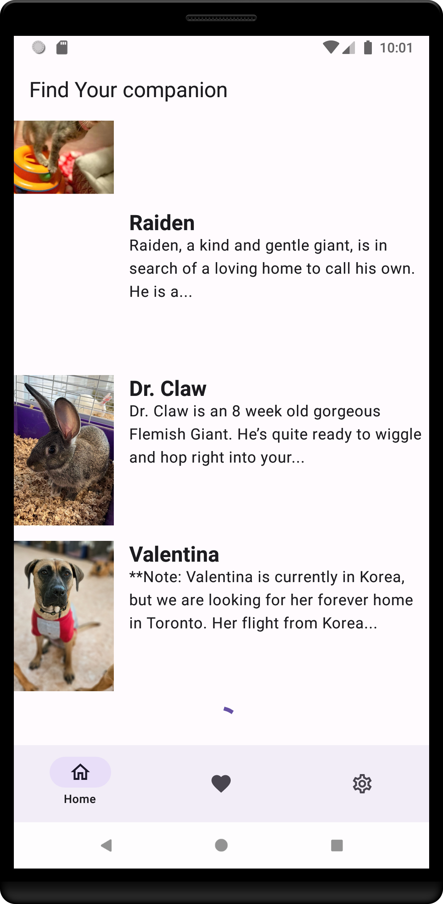

# Project Name: Adoptify

## Introduction
Adoptify is an innovative application designed to streamline the process of adopting pets, making it easier for users to find and adopt their perfect companion. Our platform connects potential adopters with animals in need of a home, providing detailed profiles for each pet, including photos, descriptions, and necessary adoption information.

- **Final Project Blog Article:** [Journey of Adoptify](#)
- **Author(s) LinkedIn:** [Author LinkedIn](https://www.linkedin.com/in/vickram-odero-a049b5231)



## Installation
To set up Adoptify locally, follow these steps:

1. Clone the repository:
   ```bash
   git clone https://github.com/yourusername/adoptify.git
